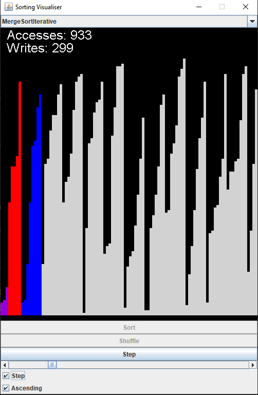

# Sorting Visualiser

This program visualises several common sorting algorithms via its GUI. 

A notable feature is the ability to step through the sorting processes at the click of a button, allowing the user to better understand how the algorithms operate; however, the sorting processes can also be viewed 'automatically', without the need for button presses.

The following sorting algorithms are included:
- Bubble Sort
- Cocktail Shaker Sort
- Selection Sort
- Insertion Sort
- Quick Sort (non-random pivot)
- Quick Sort (random pivot)
- Merge Sort (recursive)
- Merge Sort (iterative)
- Heap Sort
- Counting Sort

## Language

This program was coded and run in Java (v. 2021-12, 4.22.0).

## Instructions

1. Either (a) clone or (b) download and extract the repository to the root folder of an empty Java project.
2. Compile and run. 

## Screenshot

## Note
- You can edit the width/height of the bar-graph (in pixels) and the number of elements to sort within the top-level class (MainSortingVisualiser.java). Editing the amount of numbers can be useful if you're trying to teach someone how an algorithm works, for a lower amount of numbers lessens the apparent complexity.

## Problems
- When using merge-sort, there are some instances where the largest value in the bar-graph is removed from the screen, which causes the layout manager to re-centre the graph in the panel.
